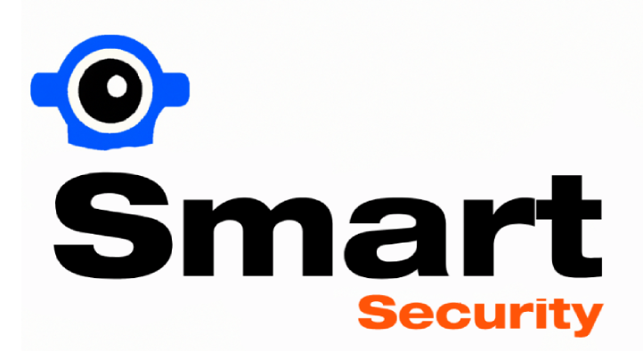

# Smart Security Camera System

## Project Description

The **Smart Security Camera System** is designed to enhance security by employing image processing and computer vision techniques to analyze video camera feeds. The system's primary goal is to detect unauthorized access or suspicious activities in a given environment. The project aims to showcase the application of computer vision technologies in the field of security.

## Features

- Real-time video feed analysis
- Unauthorized access detection
- Image processing and computer vision techniques

## Usage

To use this Python-based project, follow these steps:

1. Clone the repository: `git clone https://github.com/suyogkad/SmartSecurityCameraSystem.git`
2. Navigate to the project directory: `cd SmartSecurityCameraSystem`
3. Install the required dependencies: `pip install -r requirements.txt`
4. Run the application: `python app.py`

## Video Credits

The project uses sample video footage from YouTube for demonstration purposes. I acknowledge the creators of the following videos:

- [Sample Video 1](https://www.youtube.com/watch?v=yoZRbiUzwks) - Video by AUCOM Surveillance
- [Sample Video 2](https://www.youtube.com/watch?v=XT5QuMvg5xc) - Video by veritecuae

## Disclaimer

This project is part of an academic assignment and is not intended for commercial use. All rights to external resources belong to their respective owners.

## Contact

For inquiries about this project, please contact:

- Suyog Kadariya (UoN ID 21421999)
- suyog.kadariya20@my.northampton.ac.uk
- B.Sc (Hons) Computing (Software Engineering)