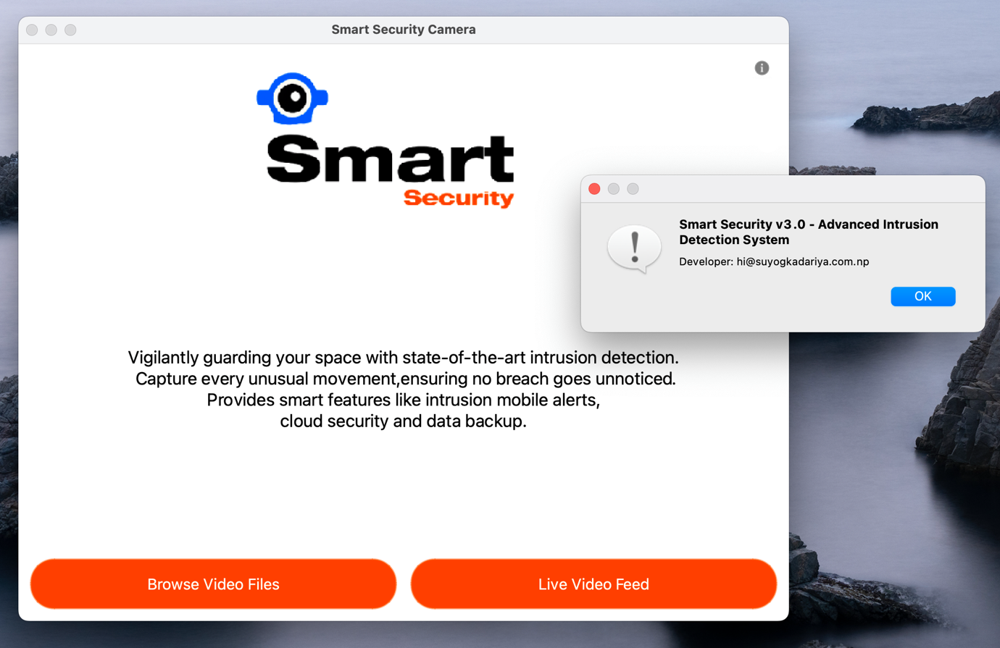
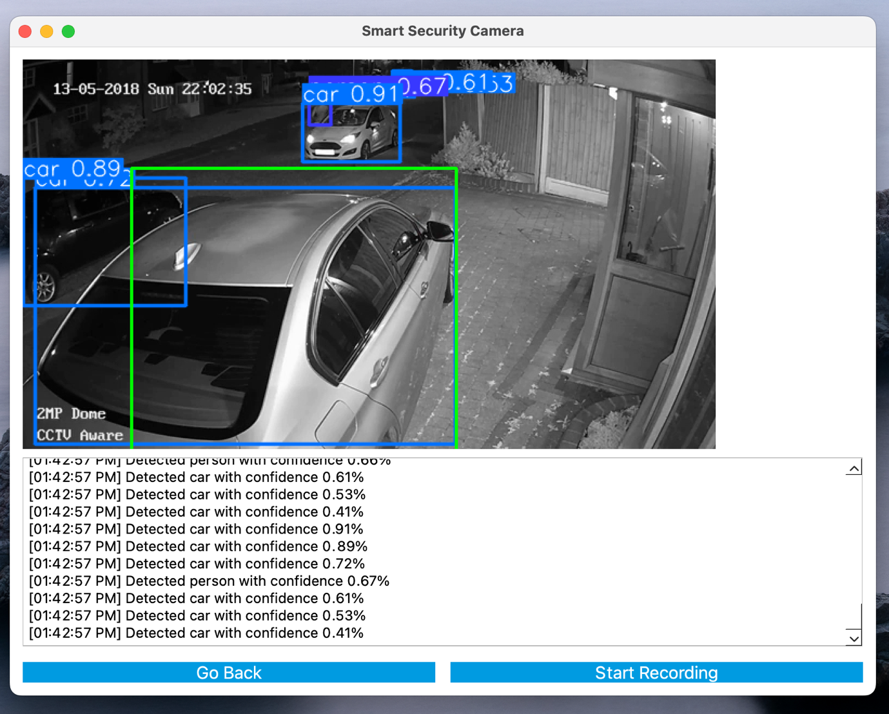
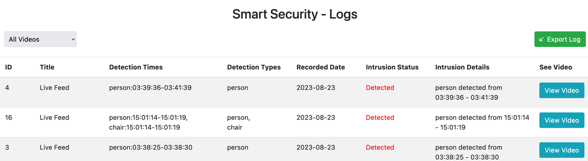
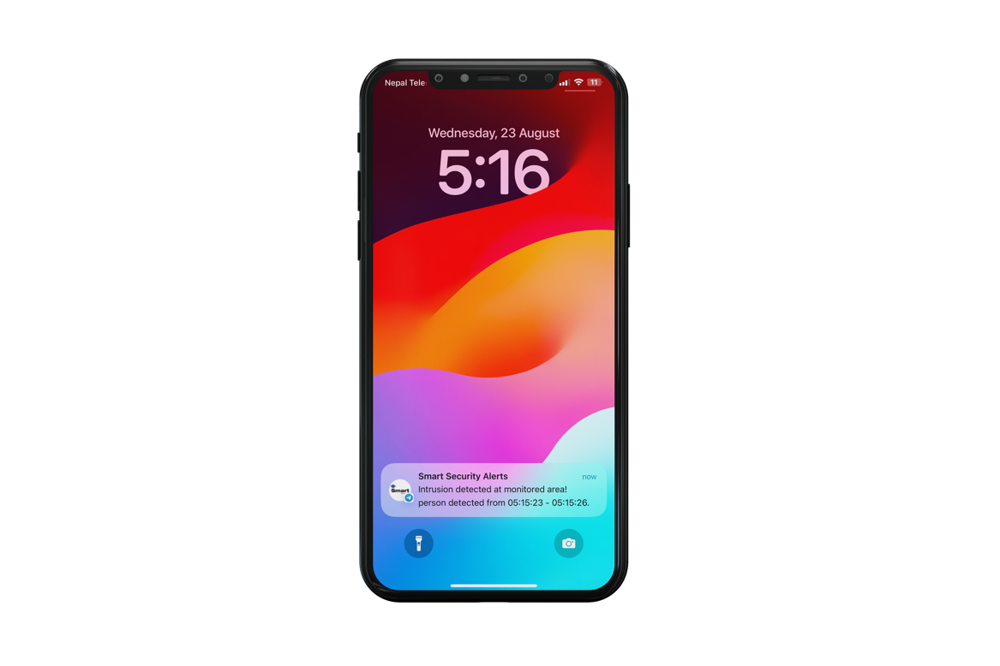
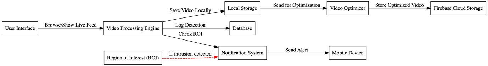
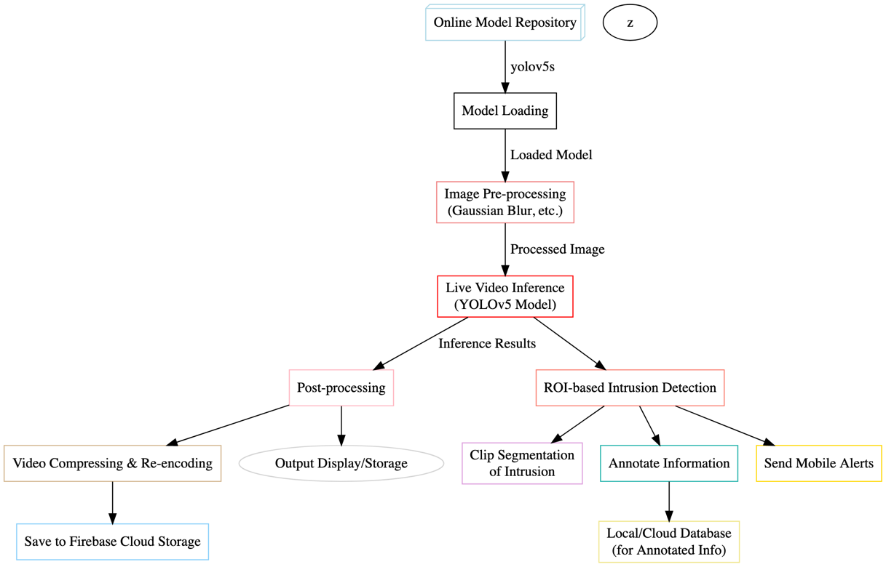

<div align="center">


# Smart Security Camera System

**Real-time intrusion detection for CCTV and webcam feeds, built with YOLOv5, OpenCV and PyQt5.**


</div>

---

## Overview

Smart Security is a desktop video-surveillance application that does more than record. It watches a video feed, recognises people, vehicles and other objects with the **YOLOv5** model, and raises an alert the moment something enters a restricted **Region of Interest (ROI)**.

When an intrusion happens, the system:

1. marks it on screen and logs the detection,
2. saves the clip with annotations (object type, first/last seen time),
3. sends an instant **Telegram** notification to your phone, and
4. backs the recording up to **Firebase** cloud storage after re-encoding and compressing it.

The project was built as the CSY3013 (Image Processing & Computer Vision) assignment at the University of Northampton.

<p align="center">
  
  
</p>

## Features

| Feature | Description |
|---|---|
| **Video import** | Analyse pre-recorded footage (`.mp4` and other OpenCV-readable formats). |
| **Live video feed** | Run detection on a webcam stream in real time. |
| **Object detection & categorisation** | YOLOv5s detects and labels people, cars, bikes and 80 COCO classes with confidence scores. |
| **ROI intrusion detection** | Any object entering the green monitored area is flagged as an intrusion. |
| **Clip saving & annotation** | Recorded sessions are stored in `savedRecordings/` and logged to SQLite with detection times and types. |
| **Mobile alerts** | Instant Telegram bot notifications when an intrusion is detected. |
| **Cloud backup** | Original and optimised recordings plus logs are uploaded to Firebase Storage / Firestore. |
| **Video optimisation** | FFmpeg re-encoding (H.264 + faststart) and zlib compression before upload. |
| **Admin panel** | Web dashboard to browse, filter and export logs and replay intrusion clips. |

## Screenshots

<table>
  <tr>
    <td align="center"><br><sub>Admin panel – security logs</sub></td>
    <td align="center" width="30%"><br><sub>Telegram intrusion alert</sub></td>
  </tr>
</table>

## How it works

<p align="center">
  
</p>

1. **Input** – frames come from a video file or the webcam through OpenCV.
2. **Inference** – each frame is passed to YOLOv5s (loaded via `torch.hub`), which returns bounding boxes, classes and confidences.
3. **ROI check** – every detection is tested against the monitored region. A new object inside it counts as an intrusion.
4. **Record & log** – while recording, frames are written to disk and each object's first/last detection time is kept. On stop, the session is saved to the `VideoLogs` table in `videoLogs.db`.
5. **Alert** – a Telegram message with the object and time range is sent.
6. **Backup** – recordings are re-encoded with FFmpeg, compressed and uploaded to Firebase. If the upload fails, the clip stays in `savedRecordings/` for a later sync.

<details>
<summary><b>Detailed processing pipeline</b></summary>
<p align="center"></p>
</details>

### Database schema (`VideoLogs`)

| Column | Type | Description |
|---|---|---|
| `id` | INTEGER | Primary key |
| `title` | TEXT | Video file name or `Live Feed` |
| `detection_times` | TEXT | `object:first-last` time ranges |
| `detection_types` | TEXT | Detected object classes |
| `saved_clip_location` | TEXT | Path or cloud URL of the clip |
| `recorded_date` | TEXT | Recording date |
| `intrusion_status` | TEXT | `Detected` / `Not Detected` |
| `intrusion_detected_at` | TEXT | Human-readable intrusion details |

## Project structure

```
.
├── app.py                  # Main PyQt5 application (entry point)
├── firebase_manager.py     # Firebase upload, FFmpeg re-encoding, zlib compression
├── requirements.txt
├── .env.example            # Template for secrets and configuration
├── assets/                 # Logo and icons used by the GUI
├── admin-panel/            # Web dashboard for viewing logs and clips
├── samples/                # Sample CCTV footage for testing
├── scripts/
│   ├── export_logs.py      # Export the SQLite log to admin-panel/dataset.csv
│   ├── video_analysis.py   # Batch-process every video in samples/
│   ├── live_detection.py   # Minimal webcam detection (OpenCV window)
│   └── send_test_alert.py  # Send a test Telegram message
├── experiments/            # Earlier prototypes kept for reference
├── tests/                  # Unit tests (model, ROI, detection, DB, GUI, Firebase, alerts)
└── docs/images/            # Screenshots and diagrams used in this README
```

Folders created at runtime such as `savedRecordings/`, `ProcessedVideos/` and `videoLogs.db` are git-ignored.

## Getting started

### Prerequisites

- **Python 3.10 – 3.12** (tested on 3.12)
- **FFmpeg** on your `PATH`, needed for re-encoding before cloud upload (`brew install ffmpeg` / `sudo apt install ffmpeg`)
- A webcam, for the live feed
- *Optional:* a Telegram bot and a Firebase project for alerts and cloud backup

### Installation

```bash
git clone https://github.com/suyogkad/SmartSecurityCameraSystem.git
cd SmartSecurityCameraSystem

python3 -m venv .venv
source .venv/bin/activate          # Windows: .venv\Scripts\activate
pip install -r requirements.txt
```

The YOLOv5s weights (`yolov5s.pt`) are downloaded automatically on first run.

### Configuration

Copy the template and fill in your own values:

```bash
cp .env.example .env
```

| Variable | Purpose |
|---|---|
| `TELEGRAM_BOT_TOKEN` | Bot token from [@BotFather](https://t.me/BotFather). Leave blank to disable alerts. |
| `TELEGRAM_CHAT_ID` | Chat ID that receives alerts. |
| `FIREBASE_CREDENTIALS` | Path to your Firebase service-account JSON key. |
| `FIREBASE_STORAGE_BUCKET` | Storage bucket, e.g. `your-project-id.appspot.com`. |

> [!IMPORTANT]
> `.env` and Firebase key files are git-ignored. Never commit real credentials.

Without Firebase credentials the app still runs and keeps recordings locally.

### Run

```bash
python app.py
```

1. Choose **Browse Video Files** to analyse a clip (try the ones in `samples/`), or **Live Video Feed** for the webcam.
2. Click **Start Recording** to begin monitoring. Detections are listed in the console panel below the video.
3. Click the **● Recording...** button again to stop. The session is saved and logged, and the alert and upload are triggered.

### Helper scripts

Run these from the project root:

```bash
python firebase_manager.py         # Upload pending logs and recordings to Firebase
python scripts/export_logs.py      # Export logs for the admin panel
python scripts/video_analysis.py   # Batch-annotate all videos in samples/ into ProcessedVideos/
python scripts/send_test_alert.py  # Check your Telegram configuration
```

### Admin panel

`admin-panel/index.html` is a static Bootstrap dashboard. It reads `admin-panel/dataset.csv`, which `scripts/export_logs.py` generates from the SQLite log. You can filter recent, all or intrusion-only videos, export the log as CSV and replay each intrusion clip.

## Testing

Unit tests cover model loading, ROI drawing, object detection, database operations, the GUI, Firebase uploads (mocked) and Telegram alerts.

```bash
python -m unittest discover -s tests -t .
```

`tests/test_alert.py` sends a real Telegram message and needs valid credentials in `.env`.

| Test case | Expectation | Result |
|---|---|---|
| Model loading | YOLOv5 loads without errors | ✅ Pass |
| ROI drawing | ROI start/end points are set from mouse events | ✅ Pass |
| Telegram alerts | Alert is sent without exceptions | ✅ Pass |
| Object detection | Correct labels returned for `tests/testimage.jpg` | ✅ Pass |
| Database operations | Table created, session saved and queried | ✅ Pass |
| UI components | Widgets render and navigation works | ✅ Pass |
| Firebase upload | Records are pushed to Firestore | ✅ Pass |

## Tech stack

- **Detection:** [YOLOv5](https://github.com/ultralytics/yolov5) (PyTorch)
- **Computer vision:** OpenCV
- **GUI:** PyQt5
- **Storage:** SQLite, Firebase Storage and Firestore
- **Alerts:** Telegram Bot API
- **Media processing:** FFmpeg, zlib
- **Admin panel:** HTML, Bootstrap, JavaScript

## Future improvements

- Draw the ROI interactively inside the PyQt video window
- Store detection lists in a normalised table instead of comma-separated text
- Custom-trained model for site-specific objects and fewer false positives
- Multi-camera support and a hosted, authenticated dashboard

## Video credits

Sample footage in `samples/` comes from YouTube and is used for demonstration only:

- [Sample Video 1](https://www.youtube.com/watch?v=yoZRbiUzwks) by AUCOM Surveillance
- [Sample Video 2](https://www.youtube.com/watch?v=XT5QuMvg5xc) by veritecuae
- [Sample Video 3](https://www.youtube.com/watch?v=zBBVnq20HFU) by Smart Jersey

## Disclaimer

This project was built for an academic assignment and is not intended for commercial use. All rights to external resources belong to their respective owners.

## Author

**Suyog Kadariya**
B.Sc. (Hons) Computing (Software Engineering), University of Northampton

- GitHub: [@suyogkad](https://github.com/suyogkad)
- Email: hi@suyogkadariya.com.np
